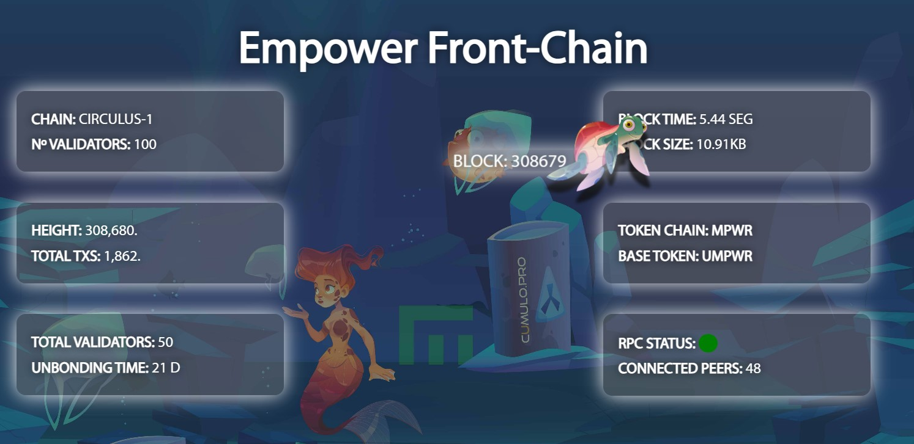

## Introduction

Publishing blockchain data as web content, whether to build a dashboard, a block explorer, or simply display certain data on the web, is often tedious, especially for front-end developers with no knowledge of technologies such as blockchain.

In addition, additional infrastructure is usually necessary to access such data, such as dedicated servers, RPC nodes, installation of services like Prometheus, Grafana, etc.

Empower Front-Chain extracts data from two sources:

  + Prometheus
  + RPC Node

## What does Empower Front Chain solve?

With this small framework we aim to solve the development time and infrastructure for publishing blockchain data on the web. Making it easy for designers to create content with a few lines of html code.

### A quick example of what we can do

Imagine you are a front-end designer and you want to integrate the data from a blockchain into a fun and attractive Dashboard for the public. You don't have to worry about anything but the design. Enter the necessary functions to display the data in the header of the page and the id to the html elements with which you want to associate the metric values. That's it! Are you ready to go?

## Getting Started

1) Add the following code inside the header <head>:

```
<script type="text/javascript" src="imp_data.js"></script>
```

2) Add the function code that corresponds to the metric to display, inside the <head> header:

```
  <script>

  //Function call (metric name, chain-id)

  showdata("block","circulus-1");

</script>
```

3) In case you enter a metric that is frequently updated you can add the following line:

 ```
<script>
     setInterval(function(){
        showdata("block","circulus-1");
 },5000); // delay 5 seg
</script>
```

4) Add the id attribute with the name of the function to the tag you want to use to display the metric value:

```
<p>Empower circulus-1 Height: <span id="block"></span></p>
```

## Package

+ imp_data.js : Holds the methods needed to create an XMLHttpRequest connection and extract the data from Prometheus or the RPC node.

+ get_prometheus.php : Contains the routines needed to open the Prometheus path (in circulus-1) and trace the code needed to display and print the metrics. Being able to display tendermint metrics: https://docs.tendermint.com/v0.34/tendermint-core/metrics.html

+ get_rpc.php : Contains the routines needed to access the RPC node (circulus-1) and execute the RPC protocols: https://docs.tendermint.com/v0.34/rpc/
Printing the results on screen.

## What else can we do?

In addition to displaying the data we can create different ways to interact with the blockchain metrics, such as sending forms with data requests, adapting the blockchain metrics to fun ways of displaying the information, such as animations, element positions, etc...

For a more complete demonstration please visit our example

[https://empower.frontchain.cumulo.pro/](https://empower.frontchain.cumulo.pro/)


